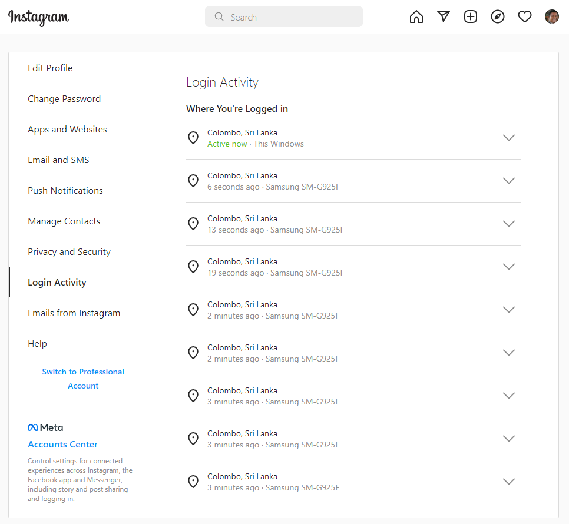

# Instagram Private API

https://github.com/dilame/instagram-private-api

# No Sessions

Login for each and every request (If you use server.js)

# Sessions

https://github.com/dilame/instagram-private-api/blob/master/examples/session.example.ts

See the 'server-3.js' file for session implementation.

After session implementation.

https://youtu.be/tX2qAKeGTtM

